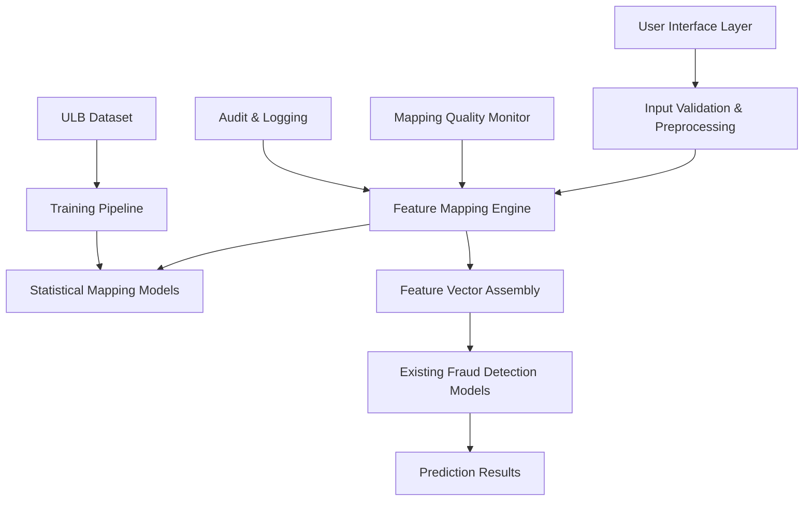

# Design Document

## Overview

The Intelligent Feature Mapping Pipeline implements a sophisticated dual-layer architecture that bridges the gap between user-friendly transaction input and the academically rigorous 30-feature vector required by models trained on the ULB dataset. This system addresses the fundamental challenge where 93% of predictive information (V1-V28 PCA components) is currently discarded due to the impossibility of users inputting cryptic PCA values.

The design leverages statistical learning techniques to create a mapping function that transforms 5 interpretable business features into estimates for the 28 PCA-transformed features, while preserving the statistical properties and predictive relationships of the original ULB dataset. This approach maintains academic integrity while dramatically improving practical usability.

## Architecture

### High-Level System Architecture



### Dual-Layer Architecture Detail

**Layer 1: User-Friendly Interface**
- Collects 5 interpretable features from users
- Provides intelligent defaults and validation
- Offers contextual guidance and examples

**Layer 2: Statistical Feature Mapping**
- Transforms user inputs into 30-feature vector
- Maintains statistical properties of ULB dataset
- Provides confidence metrics and explanations

## Components and Interfaces

### 1. Feature Input Interface

**Purpose**: Collect user-friendly transaction attributes
**Location**: `src/fraudguard/components/feature_input.py`

```python
class FeatureInputInterface:
    def collect_user_inputs(self) -> UserTransactionInput:
        """Collect 5 interpretable features from user"""
        
    def validate_inputs(self, inputs: UserTransactionInput) -> ValidationResult:
        """Validate user inputs and provide feedback"""
        
    def suggest_defaults(self, partial_inputs: dict) -> dict:
        """Provide intelligent defaults based on patterns"""
```

**Input Schema**:
```python
@dataclass
class UserTransactionInput:
    transaction_amount: float
    merchant_category: MerchantCategory  # Enum: grocery, gas, online, restaurant, atm, other
    time_context: TimeContext  # hour_of_day, day_of_week, is_weekend, is_holiday
    location_risk: LocationRisk  # Enum: normal, slightly_unusual, highly_unusual, foreign
    spending_pattern: SpendingPattern  # Enum: typical, slightly_higher, much_higher, suspicious
```

### 2. Statistical Feature Mapping Engine

**Purpose**: Transform 5 user inputs into 28 PCA feature estimates
**Location**: `src/fraudguard/components/feature_mapper.py`

```python
class FeatureMappingEngine:
    def __init__(self):
        self.mapping_models: Dict[str, BaseMapper] = {}
        self.feature_scaler: StandardScaler = None
        self.quality_monitor: MappingQualityMonitor = None
        
    def map_features(self, user_input: UserTransactionInput) -> MappingResult:
        """Transform user inputs to 30-feature vector"""
        
    def validate_mapping_quality(self, mapped_features: np.ndarray) -> QualityMetrics:
        """Assess quality of feature mapping"""
        
    def explain_mapping(self, user_input: UserTransactionInput, 
                       mapped_features: np.ndarray) -> MappingExplanation:
        """Provide explanation of how inputs were mapped"""
```

### 3. Multi-Output Regression Models

**Purpose**: Learn relationships between interpretable features and PCA components
**Location**: `src/fraudguard/models/feature_mapping_models.py`

```python
class BaseFeatureMapper(ABC):
    @abstractmethod
    def fit(self, X_interpretable: np.ndarray, y_pca_components: np.ndarray):
        """Train mapping from interpretable features to PCA components"""
        
    @abstractmethod
    def predict(self, X_interpretable: np.ndarray) -> np.ndarray:
        """Predict PCA component values from interpretable features"""

class RandomForestMapper(BaseFeatureMapper):
    """Random Forest multi-output regression for feature mapping"""
    
class XGBoostMapper(BaseFeatureMapper):
    """XGBoost multi-output regression for feature mapping"""
    
class NeuralNetworkMapper(BaseFeatureMapper):
    """Neural network approach for complex feature relationships"""
    
class EnsembleMapper(BaseFeatureMapper):
    """Ensemble of multiple mapping approaches for robustness"""
```

### 4. Feature Vector Assembly

**Purpose**: Combine original and mapped features into complete 30-feature vector
**Location**: `src/fraudguard/components/feature_assembler.py`

```python
class FeatureVectorAssembler:
    def assemble_feature_vector(self, 
                               user_input: UserTransactionInput,
                               mapped_pca: np.ndarray) -> np.ndarray:
        """Combine Time, Amount, and mapped V1-V28 into 30-feature vector"""
        
    def validate_feature_bounds(self, feature_vector: np.ndarray) -> bool:
        """Ensure features are within reasonable bounds based on ULB dataset"""
        
    def apply_statistical_corrections(self, feature_vector: np.ndarray) -> np.ndarray:
        """Apply corrections to maintain ULB dataset statistical properties"""
```

## Data Models

### Core Data Structures

```python
@dataclass
class MappingResult:
    feature_vector: np.ndarray  # Complete 30-feature vector
    confidence_score: float     # Mapping quality confidence (0-1)
    mapping_explanation: MappingExplanation
    quality_metrics: QualityMetrics
    processing_time_ms: float

@dataclass
class MappingExplanation:
    input_contributions: Dict[str, float]  # SHAP values for each input
    pca_estimates: Dict[str, float]        # Estimated V1-V28 values
    confidence_intervals: Dict[str, Tuple[float, float]]
    business_interpretation: str           # Human-readable explanation

@dataclass
class QualityMetrics:
    correlation_preservation: float       # How well correlations are maintained
    distribution_similarity: float        # KL divergence from ULB distribution
    prediction_consistency: float         # Consistency with fraud model expectations
    mapping_uncertainty: float            # Uncertainty in PCA estimates
```

### Training Data Schema

```python
@dataclass
class TrainingDataPoint:
    # Original ULB features
    time: float
    amount: float
    v1_to_v28: np.ndarray  # Original PCA components
    class_label: int
    
    # Derived interpretable features (for training mapping models)
    merchant_category_encoded: int
    time_context_features: np.ndarray
    location_risk_score: float
    spending_pattern_score: float
```

## Error Handling

### Error Categories and Responses

1. **Input Validation Errors**
   - Invalid merchant category → Suggest valid options
   - Negative transaction amount → Request positive value
   - Missing required fields → Highlight incomplete inputs

2. **Mapping Model Errors**
   - Model unavailable → Fall back to conservative estimation
   - Prediction out of bounds → Apply statistical corrections
   - Low confidence mapping → Warn user and suggest manual review

3. **Performance Errors**
   - Timeout in mapping → Use cached/simplified mapping
   - Memory constraints → Switch to lightweight mapping model
   - High load → Queue requests with priority handling

### Graceful Degradation Strategy

```python
class FallbackMappingStrategy:
    def get_conservative_mapping(self, user_input: UserTransactionInput) -> np.ndarray:
        """Provide conservative PCA estimates when primary mapping fails"""
        
    def use_dataset_averages(self, merchant_category: MerchantCategory) -> np.ndarray:
        """Use category-based averages from ULB dataset analysis"""
        
    def apply_uncertainty_bounds(self, estimates: np.ndarray) -> np.ndarray:
        """Apply wider uncertainty bounds for conservative estimates"""
```

## Testing Strategy

### Unit Testing

1. **Feature Input Validation**
   - Test all input combinations and edge cases
   - Validate error messages and suggestions
   - Test default value generation

2. **Mapping Model Testing**
   - Test each mapping model individually
   - Validate multi-output regression performance
   - Test ensemble combination logic

3. **Feature Assembly Testing**
   - Test vector assembly with various inputs
   - Validate statistical corrections
   - Test bounds checking

### Integration Testing

1. **End-to-End Pipeline Testing**
   - Test complete flow from user input to fraud prediction
   - Validate performance requirements (sub-50ms)
   - Test error handling and fallback mechanisms

2. **Model Compatibility Testing**
   - Test with all existing fraud detection models
   - Validate prediction consistency
   - Test explanation generation

### Performance Testing

1. **Latency Testing**
   - Measure mapping time under various loads
   - Test concurrent request handling
   - Validate sub-10ms mapping requirement

2. **Accuracy Testing**
   - Compare mapped features against actual ULB features
   - Measure downstream fraud detection accuracy
   - Test correlation preservation

### Validation Testing

1. **Statistical Validation**
   - Validate feature distributions match ULB dataset
   - Test correlation preservation across feature pairs
   - Measure prediction consistency with original models

2. **Business Logic Validation**
   - Test merchant category mappings make business sense
   - Validate time context interpretations
   - Test location and spending pattern logic

## Implementation Phases

### Phase 1: Core Mapping Infrastructure (Weeks 1-2)
- Implement base feature mapping classes
- Create training data preparation pipeline
- Develop basic Random Forest mapping model
- Implement feature vector assembly

### Phase 2: Advanced Mapping Models (Weeks 3-4)
- Implement XGBoost and Neural Network mappers
- Develop ensemble mapping approach
- Add statistical validation and quality metrics
- Implement fallback strategies

### Phase 3: User Interface Integration (Weeks 5-6)
- Integrate with existing web interface
- Implement input validation and suggestions
- Add mapping explanations and confidence indicators
- Develop audit logging and monitoring

### Phase 4: Performance Optimization (Weeks 7-8)
- Optimize mapping model performance
- Implement caching and load balancing
- Add comprehensive error handling
- Conduct end-to-end performance testing

### Phase 5: Validation and Documentation (Weeks 9-10)
- Validate against ULB dataset benchmarks
- Conduct user acceptance testing
- Complete documentation and training materials
- Prepare for production deployment